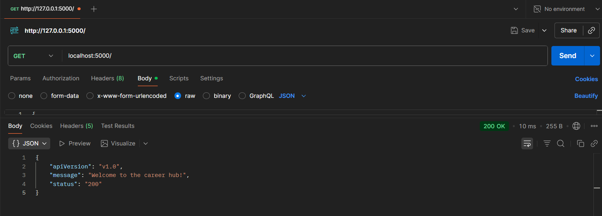
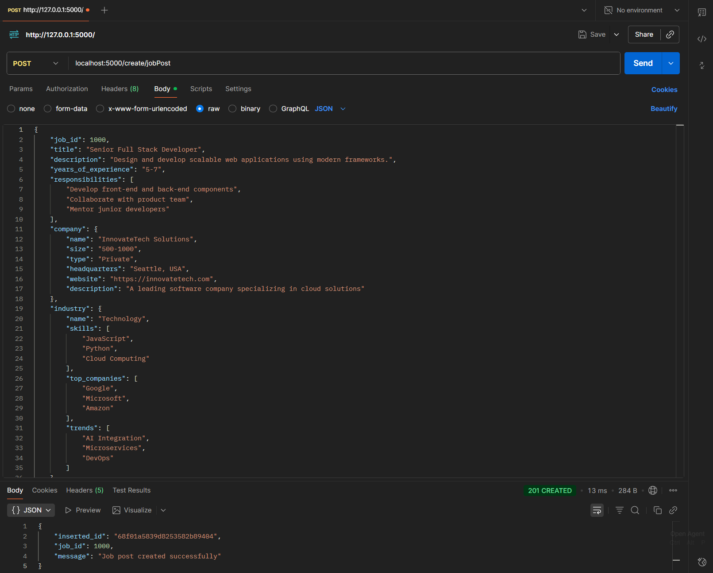
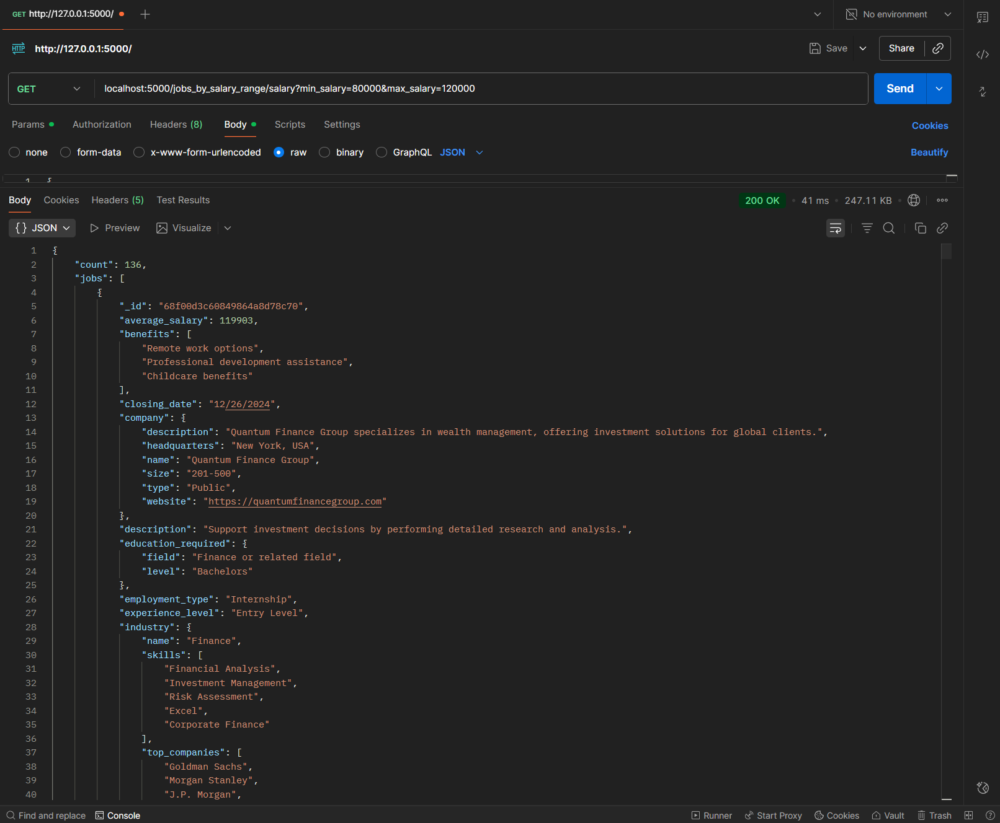

# CareerHub: Mini Job Portal with MongoDB and Flask

A full-stack job portal application built with Flask and MongoDB, featuring a RESTful API for managing job postings. This project demonstrates the implementation of a denormalized NoSQL database schema optimized for modern web applications.

### Quick Navigation
[Goal](#goal)  
[Background](#background)  
[Prerequisites](#prerequisites)  
[Setup Instructions](#setup-instructions)  
[Data](#data)  
[API Endpoints](#api-endpoints)  
[Testing with Postman](#testing-with-postman)  
[Repo Structure](#repo-structure)  
[Resources](#resources)  
[Contact](#contact-info)

# Goal

The goal of this project is to build a functional job portal API that:
- Implements a denormalized MongoDB schema optimized for query performance
- Provides comprehensive RESTful endpoints for job posting management
- Demonstrates NoSQL database design principles and best practices
- Offers flexible querying capabilities (by industry, location, salary, skills, etc.)
- Includes proper data validation and error handling

# Background

This project explores the differences between relational and NoSQL databases by transforming structured CSV data into a document-based MongoDB schema. Rather than maintaining separate normalized tables with foreign key relationships, the application uses a denormalized "job-centric" approach where each job document embeds related information about companies, industries, education requirements, and skills.

This design pattern is optimized for read-heavy operations common in job portals, where users frequently query jobs by multiple criteria without needing complex joins. The Flask-based REST API provides intuitive endpoints for creating, reading, updating, and deleting job postings.

# Prerequisites

To run this project, you need the following installed:

**Required Software:**
- Python 3.12 or higher
- Docker Desktop (for MongoDB container)
- Docker Compose
- Git

**Required Python Packages:**
```
flask
pymongo
pandas
```

Install Python dependencies using:
```bash
pip install -r requirements.txt
```

# Setup Instructions

## 1. Clone the Repository

```bash
git clone <repository-url>
cd mini_job_portal
```

## 2. Start MongoDB with Docker Compose

Start the MongoDB container in detached mode:

```bash
docker-compose up -d
```

Verify MongoDB is running:
```bash
docker ps -a
```

You should see a container named `mongodb_careerhub` running on port 27017.

## 3. Transform CSV Data to JSON

The project includes CSV files that need to be transformed into a denormalized JSON format. Run the data conversion script:

```bash
python convert_data.py
```

This will create `converted_data.json` in the data directory.

## 4. Import Data into MongoDB

Import the transformed JSON data into MongoDB:

```bash
docker-compose exec mongodb sh

mongoimport --db careerhub --collection jobs --file /data/converted_data.json --jsonArray
```

## 5. Run the Flask Application

Start the Flask development server:

```bash
python run_app_docker.py
```

The API will be available at `http://localhost:5000`

You should see output similar to:
```
* Running on http://0.0.0.0:5000
* Debug mode: on
```

The application will auto-reload when you make changes to the code.

# Data

## Data Structure

The project uses a denormalized MongoDB schema centered around job postings. Each job document contains:

**Core Job Information:**
- Job ID, title, description
- Years of experience required
- Responsibilities (array)
- Experience level (Entry/Mid/Senior)

**Embedded Company Information:**
- Company name, size, type
- Headquarters location
- Website and description

**Embedded Industry Information:**
- Industry name
- Common skills in the industry
- Top companies
- Current trends

**Embedded Education Requirements:**
- Degree level required
- Field of study

**Job Details:**
- Employment type (Full-time, Part-time, Contract)
- Average salary
- Benefits (array)
- Remote work availability
- Location
- Posting and closing dates

**Skills Required:**
- Array of skill names (e.g., Python, SQL, Machine Learning)

## Schema Design Rationale

I decided to center the data to be "job-centric." This makes the most sense as jobs are the heart of the application. The denormalized approach:

1. **Eliminates join operations**: All related data is embedded directly in job documents
2. **Optimizes read performance**: Single query retrieves complete job information
3. **Simplifies query logic**: No need to manually join data from multiple collections
4. **Matches real-world usage**: Job postings are typically consumed as complete units

While this approach creates some data duplication (e.g., company information repeated across multiple jobs), it significantly improves query performance for the read-heavy operations typical of job portals.

## Data Security

This project uses sample data for educational purposes. In a production environment:
- Implement authentication and authorization
- Use environment variables for database credentials
- Enable MongoDB access controls
- Implement rate limiting on API endpoints
- Sanitize all user inputs

## Data Counts

The dataset contains approximately 364 job postings across multiple industries including:
- Technology
- Finance
- Healthcare
- Education
- Retail

Jobs span three experience levels:
- Entry Level: 0-2 years experience
- Mid Level: 3-5 years experience
- Senior Level: 6+ years experience

# API Endpoints

The API provides the following endpoints for job management:

## 1. Homepage / Welcome Message

**Endpoint:** `GET /`

**Description:** Returns a welcome message and API version information.

**Example Response:**
```json
{
  "apiVersion": "v1.0",
  "status": "200",
  "message": "Welcome to the career hub!"
}
```
**Example Screenshot**


---

## 2. Create a Job Post

**Endpoint:** `POST /create/jobPost`

**Description:** Creates a new job posting with validation for required fields.

**Required Fields:**
- `title` (string)
- `company` (object with `name` field)
- `industry` (object with `name` field)
- `posting_date` (string)

**Example Request Body:**
```json
{
  "job_id": 1000,
  "title": "Senior Full Stack Developer",
  "description": "Design and develop scalable web applications.",
  "years_of_experience": "5-7",
  "company": {
    "name": "InnovateTech Solutions",
    "size": "500-1000",
    "type": "Private",
    "headquarters": "Seattle, USA"
  },
  "industry": {
    "name": "Technology"
  },
  "posting_date": "01/15/2025"
}
```

**Success Response (201):**
```json
{
  "message": "Job post created successfully",
  "inserted_id": "671234567890abcdef123456",
  "job_id": 1000
}
```
**Example Screenshot**


---

## 3. View Job Details by ID

**Endpoint:** `GET /view_jobs_by_id/<job_id>`

**Description:** Retrieves full details for a single job by its unique job ID.

**Path Parameter:**
- `job_id` (integer): Unique job identifier

**Example Request:**
```
GET http://localhost:5000/view_jobs_by_id/1
```

**Success Response (200):** Returns complete job document

**Error Response (404):**
```json
{
  "error": "Job not found",
  "message": "No job found with job_id: 1"
}
```

---

## 4. Query Jobs by Industry

**Endpoint:** `GET /jobs/industry/<industry_name>`

**Description:** Returns all jobs matching the specified industry (case-insensitive).

**Path Parameter:**
- `industry_name` (string): Industry name

**Example Request:**
```
GET http://localhost:5000/jobs/industry/Technology
```

**Success Response (200):**
```json
{
  "industry": "Technology",
  "count": 150,
  "jobs": [...]
}
```

---

## 5. Query Jobs by Salary Range

**Endpoint:** `GET /jobs/salary?min_salary=<min>&max_salary=<max>`

**Description:** Returns jobs within the specified salary range.

**Query Parameters:**
- `min_salary` (integer): Minimum salary
- `max_salary` (integer): Maximum salary

**Example Request:**
```
GET http://localhost:5000/jobs/salary?min_salary=80000&max_salary=120000
```

**Success Response (200):**
```json
{
  "min_salary": 80000,
  "max_salary": 120000,
  "count": 45,
  "jobs": [...]
}
```
**Example Screenshot:**


---

## 6. Query Jobs by Location

**Endpoint:** `GET /jobs/location/<location>`

**Description:** Returns jobs available in a specific location (based on company headquarters).

**Path Parameter:**
- `location` (string): Location name (handles spaces and commas via URL encoding)

**Example Request:**
```
GET http://localhost:5000/jobs/location/New York, USA
```

**Success Response (200):**
```json
{
  "location": "New York, USA",
  "count": 23,
  "jobs": [...]
}
```

---

## 7. Query Jobs by Single Skill

**Endpoint:** `GET /jobs/skill/<skill_name>`

**Description:** Returns jobs requiring a specific skill (case-insensitive).

**Path Parameter:**
- `skill_name` (string): Skill name

**Example Request:**
```
GET http://localhost:5000/jobs/skill/Python
```

**Success Response (200):**
```json
{
  "skill": "Python",
  "count": 85,
  "jobs": [...]
}
```

---

## 8. Query Jobs by Multiple Skills

**Endpoint:** `GET /jobs/skills/<skill1>&<skill2>&<skill3>`

**Description:** Returns jobs requiring ALL specified skills (case-insensitive). Skills are separated by ampersand (&).

**Path Parameter:**
- `skill_names` (string): Ampersand-separated list of skills

**Example Request:**
```
GET http://localhost:5000/jobs/skills/Python&SQL&Machine Learning
```

**Success Response (200):**
```json
{
  "skills": ["Python", "SQL", "Machine Learning"],
  "count": 12,
  "jobs": [...]
}
```


---

## 9. Query Jobs by Company Name

**Endpoint:** `GET /jobs/company/<company_name>`

**Description:** Returns all jobs from a specific company (case-insensitive, exact match).

**Path Parameter:**
- `company_name` (string): Company name

**Example Request:**
```
GET http://localhost:5000/jobs/company/Quantum Finance Group
```

**Success Response (200):**
```json
{
  "company": "Quantum Finance Group",
  "count": 5,
  "jobs": [...]
}
```

---

## 10. Count Jobs per Industry

**Endpoint:** `GET /jobs/count/industry`

**Description:** Returns a count of jobs grouped by industry, sorted by count descending.

**Example Request:**
```
GET http://localhost:5000/jobs/count/industry
```

**Success Response (200):**
```json
{
  "total_industries": 5,
  "industries": [
    {
      "industry": "Technology",
      "job_count": 150
    },
    {
      "industry": "Healthcare",
      "job_count": 85
    }
  ]
}
```

---

## 11. Top 5 Highest-Paying Jobs

**Endpoint:** `GET /jobs/top/salary`

**Description:** Returns the top 5 jobs sorted by salary (descending).

**Example Request:**
```
GET http://localhost:5000/jobs/top/salary
```

**Success Response (200):**
```json
{
  "count": 5,
  "top_paying_jobs": [...]
}
```

---

## 12. List All Companies Hiring

**Endpoint:** `GET /jobs/companies`

**Description:** Returns a unique list of all companies with active job postings, sorted alphabetically.

**Example Request:**
```
GET http://localhost:5000/jobs/companies
```

**Success Response (200):**
```json
{
  "count": 25,
  "companies": [
    "Acme Corporation",
    "DataFlow Systems",
    "Quantum Finance Group"
  ]
}
```

---

## 13. Query Jobs by Degree Requirement

**Endpoint:** `GET /jobs/degree/<degree_name>`

**Description:** Returns jobs requiring a specific degree level (case-insensitive).

**Path Parameter:**
- `degree_name` (string): Degree level (e.g., "Bachelor's", "Masters", "PhD")

**Example Request:**
```
GET http://localhost:5000/jobs/degree/Masters
```

**Success Response (200):**
```json
{
  "degree": "Masters",
  "count": 42,
  "jobs": [...]
}
```

---

## 14. Query Jobs by Experience Level

**Endpoint:** `GET /jobs/experience?experience_level=<level>`

**Description:** Returns jobs matching the specified experience level.

**Query Parameter:**
- `experience_level` (string): Experience level (e.g., "Entry Level", "Mid Level", "Senior Level")

**Example Request:**
```
GET http://localhost:5000/jobs/experience?experience_level=Mid Level
```

**Success Response (200):**
```json
{
  "experience_level": "Mid Level",
  "count": 120,
  "jobs": [...]
}
```

---

## 15. Update a Job Posting

**Endpoint:** `POST /jobs/update/<job_id>`

**Description:** Partially updates a job posting. Validates field types and rejects unknown fields.

**Path Parameter:**
- `job_id` (integer): Job ID to update

**Request Body:** JSON object with fields to update (job_id in body is ignored)

**Example Request:**
```json
{
  "title": "Senior Quantitative Researcher",
  "average_salary": 65000,
  "remote": true
}
```

**Success Response (200):**
```json
{
  "message": "Job post updated successfully",
  "job_id": 1,
  "fields_updated": ["title", "average_salary", "remote"],
  "modified_count": 1
}
```

**Error Response (400) - Unknown Field:**
```json
{
  "error": "Bad request",
  "message": "Unknown fields: invalid_field"
}
```


---

## 16. Delete a Job Posting

**Endpoint:** `DELETE /jobs/delete/<job_id>`

**Description:** Deletes a job posting by its job ID.

**Path Parameter:**
- `job_id` (integer): Job ID to delete

**Example Request:**
```
DELETE http://localhost:5000/jobs/delete/1
```

**Success Response (200):**
```json
{
  "message": "Job post deleted successfully",
  "job_id": 1,
  "deleted_count": 1
}
```

**Error Response (404):**
```json
{
  "error": "Job not found",
  "message": "No job found with job_id: 1"
}
```

# Testing with Postman

## Setting Up Postman

1. Download and install Postman from https://www.postman.com/downloads/
2. Set the base URL: `http://localhost:5000`

## Testing Workflow

1. **Start with the homepage** to verify the API is running
2. **View an existing job** to see the data structure
3. **Test query endpoints** with various parameters
4. **Create a new job** to test POST functionality
5. **Update the job** you created
6. **Delete the job** to test DELETE functionality

## Common Testing Tips

- Use Postman's environment variables for reusable values (like job_id)
- Save successful requests to your collection for future reference
- Test error cases (invalid IDs, missing parameters) to verify error handling

# Repo Structure

The repository is structured as follows:

```
mini_job_portal/
├── app/
│   ├── __init__.py           # Flask app initialization
│   ├── career_hub.py         # Main API routes and endpoints
│   └── utils.py              # Utility functions for query parsing
├── data/
│   ├── companies.csv         # Original company data
│   ├── education.csv         # Original education data
│   ├── industries.csv        # Original industry data
│   ├── jobs.csv              # Original jobs data
│   ├── jobs_detail.csv       # Original job details data
│   ├── skills.csv            # Original skills data
│   └── converted_data.json   # Transformed denormalized JSON data
├── notebooks/
│   ├── 00_explore_data.ipynb # Initial data exploration
├── convert_data.py           # Script to transform CSV to JSON
├── docker-compose.yml        # Docker configuration for MongoDB
├── run_app_docker.py         # Flask application entry point
├── requirements.txt          # Python dependencies
├── schema_design.png         # Database schema diagram
└── README.md                 # This file
```

**Key Files:**
- `career_hub.py`: Contains all API endpoint implementations with comprehensive comments
- `convert_data.py`: Transforms relational CSV data into denormalized JSON format
- `docker-compose.yml`: Defines MongoDB container configuration
- `run_app_docker.py`: Runs Flask in debug mode with auto-reload

**Development Workflow:**
1. Make changes to `career_hub.py`
2. Flask automatically reloads (no restart needed)
3. Test endpoints in Postman
4. Document any new endpoints in this README

# Resources

**MongoDB:**
- MongoDB Manual: https://docs.mongodb.com/manual/
- PyMongo Documentation: https://pymongo.readthedocs.io/
- MongoDB Aggregation Pipeline: https://docs.mongodb.com/manual/aggregation/

**Flask:**
- Flask Documentation: https://flask.palletsprojects.com/
- Flask RESTful API Tutorial: https://flask-restful.readthedocs.io/
- Flask Best Practices: https://flask.palletsprojects.com/en/2.3.x/patterns/

**Python Data Manipulation:**
- Pandas Documentation: https://pandas.pydata.org/docs/
- Python JSON Module: https://docs.python.org/3/library/json.html

**Docker:**
- Docker Documentation: https://docs.docker.com/
- Docker Compose: https://docs.docker.com/compose/

**API Testing:**
- Postman Learning Center: https://learning.postman.com/
- REST API Best Practices: https://restfulapi.net/

# Contact Info

**Project Developer:** [Beema Rajan]  
**Email:** [code.beema@gmail.com]  